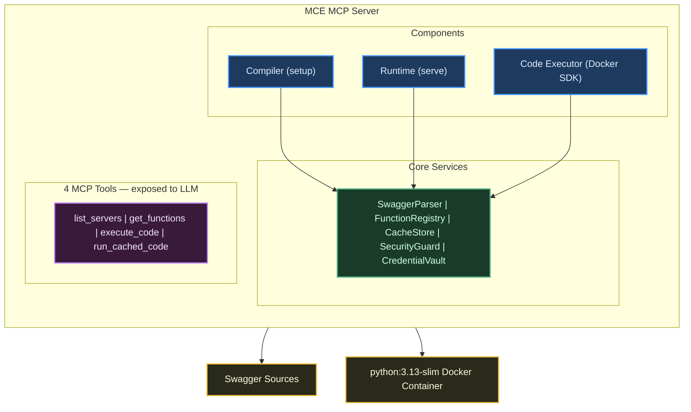
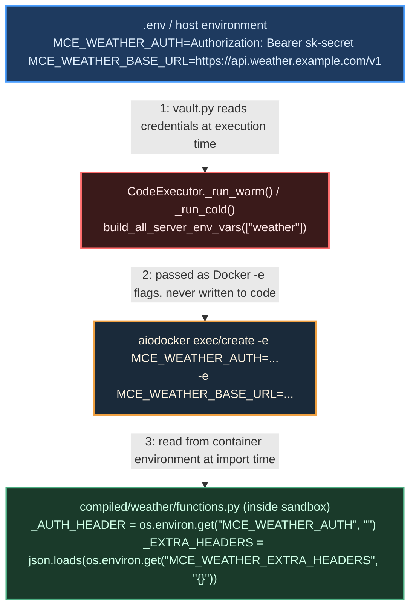

# MCE — MCP Code Execution

> **APIs were designed for developers. MCE recompiles them for AI.**

[](https://github.com/hypen-code/mcp-code-execution/actions)
[](https://www.python.org/)
[](LICENSE)

## The Problem

1. **Context window bloat** — Naive Swagger-to-MCP tools expose every API endpoint as a separate tool. A 200-endpoint API burns hundreds of tokens per call just describing tools the LLM will never use.
2. **Tool processing limits** — MCP clients cap tool counts. Large APIs hit the limit and fail silently.
3. **Insecure execution** — Running LLM-generated code on the host is dangerous. You need isolation.
4. **Bloated responses** — Raw API responses dump everything: metadata, nulls, pagination envelopes, deprecated fields. The LLM sees 90% noise and wastes context on data it never needed.
5. **Integration friction** — Every API with a Swagger spec should be instantly usable by an LLM. Instead, developers spend days writing glue code, auth wrappers, and prompt scaffolding just to call a single endpoint.

## The Solution

MCE exposes **4 meta-tools + 1 prompt** instead of N API-specific tools:

```
list_servers        → discover available APIs and their functions
get_functions       → inspect 1–5 function signatures, typed return classes, and response schemas (batch)
execute_code        → run Python in a sandboxed Docker container; returns a cache_id on success
run_cached_code     → SIMD: re-run the same cached code with different input data

reusable_code_guide → prompt: concise rules for writing parameterized, cacheable code
```

The LLM workflow: **discover → inspect → execute → reuse (SIMD)**



## Quick Start

### 1. Clone & Install

```bash
git clone https://github.com/hypen-code/mcp-code-execution.git
cd mcp-code-execution
pip install -e ".[dev]"

# Optional: LLM-enhanced compilation (OpenAI, Gemini, Anthropic, OpenRouter)
pip install -e ".[llm]"
```

### 2. Configure

```bash
cp .env.example .env
# Edit .env with your API credentials

cp config/swaggers.yaml.example config/swaggers.yaml
# Edit to point at your swagger URLs
```

### 3. Build the Sandbox

```bash
docker build -t mce-sandbox:latest sandbox/
docker network create mce_network
```

### 4. Compile Swagger Sources

```bash
mce compile
# ✅ Compiled: weather, hotel_booking (12 endpoints)
# --- MCP Server Config (add to your MCP client) ---
# { ... ready-to-use config snippet ... }

# Optional: enhance docstrings and examples with an LLM
mce compile --llm-enhance

# Validate without writing output
mce compile --dry-run

# Remove compiled output and recompile
mce clean compile
```

### 5. Run the MCP Server

```bash
# stdio mode (for Claude Desktop, Cursor, etc.)
mce serve

# HTTP mode
mce serve --transport http --port 8000

# Compile + serve in one command
mce run

# Use a custom .env file (works with all subcommands)
mce serve --env-file /path/to/.env.production
mce run --env-file /path/to/.env.staging
```

### 6. Connect to Your MCP Client

Add to your `mcp_servers.json` (Claude Desktop example):

```json
{
  "mcpServers": {
    "mcp-code-execution": {
      "command": "~/mcp-code-execution/.venv/bin/mce",
      "args": ["serve"],
      "env": {
        "MCE_COMPILED_OUTPUT_DIR": "~/mcp-code-execution/compiled",
        "MCE_SWAGGER_CONFIG_FILE": "~/mcp-code-execution/config/swaggers.yaml",
        "MCE_DOCKER_IMAGE": "mce-sandbox:latest",
        "MCE_NETWORK_MODE": "mce_network",
        "MCE_CACHE_DB_PATH": "~/mcp-code-execution/data/cache.db"
      }
    }
  }
}
```

> `mce compile` prints a ready-to-use config snippet you can paste directly.

## How It Works

### Tool Workflow Example

```
LLM → list_servers()
← { sandbox_libraries: [...], servers: [{ name: "weather", functions: [...] }] }

LLM → get_functions([{"server_name": "weather", "function_name": "get_current_weather"}])
← { functions: [{ parameters: [...], import_statement: "from weather.functions import get_current_weather", ... }] }

LLM → execute_code("""
from weather.functions import get_current_weather

city = "London"           # top-level variable — the only thing that changes per request

def main():
    return get_current_weather(city=city, units="metric")

result = main()
""", description="get weather by city")
← { success: true, data: { temperature: 15.2, condition: "Cloudy" }, cache_id: "abc123" }
```

### SIMD — Single Instruction, Multiple Data

`run_cached_code` is the SIMD pattern: the same code runs unchanged, only the input data varies.
The `cache_id` from any successful `execute_code` response is reused directly — no rewriting, no re-inspecting functions.

```
# User asks for Paris weather — city is the only thing that changes
LLM → run_cached_code("abc123", params={"city": "Paris"})
← { success: true, data: { temperature: 18.5, condition: "Sunny" }, cache_id: "def456" }

# And again for Tokyo
LLM → run_cached_code("abc123", params={"city": "Tokyo"})
← { success: true, data: { temperature: 12.0, condition: "Clear" }, cache_id: "ghi789" }
```

For this to work, all dynamic values in `execute_code` must be **top-level variables** that `main()` reads as globals — never hardcoded inside `main()`.

> **`get_functions` must be called before writing any `execute_code` payload.** It returns the exact `import_statement`, parameter names, and response schema. Guessing will produce broken code.

> **`execute_code` requires** a `main()` function (no arguments) that reads top-level variables, plus `result = main()` at module level.

### Typed Return Types

At compile time, MCE parses each endpoint's swagger response schema and generates a `TypedDict` class that exactly describes the response fields and their Python types. The `get_functions` tool returns this class definition alongside the function signature in `usage_example`:

```python
# Returned by get_functions — ready to copy into execute_code
class GetTreatmentCaseByIdResponse(TypedDict, total=False):
    id: int
    caseType: str
    status: str
    participants: list[Any]

def get_treatment_case_by_id(id: int) -> GetTreatmentCaseByIdResponse:
    ...
```

This lets LLMs write chained code with confidence — field names and types are explicit, not guessed. Functions without a parseable swagger response schema fall back to `-> Any`.

## Configuration

### Custom `.env` File

By default, MCE loads `.env` from the current working directory. You can override this with the `--env-file` flag on any subcommand:

```bash
mce compile --env-file /path/to/.env.production
mce serve   --env-file /path/to/.env.staging
mce run     --env-file /path/to/.env.local
mce clean   --env-file /path/to/.env.local
```

Explicit environment variables always take precedence over values in the `.env` file.

### Environment Variables

| Variable | Default | Description |
|----------|---------|-------------|
| `MCE_LOG_LEVEL` | `INFO` | Log verbosity |
| `MCE_DEBUG` | `false` | Enable debug mode |
| `MCE_HOST` | `0.0.0.0` | HTTP server bind host |
| `MCE_PORT` | `8000` | HTTP server port |
| `MCE_COMPILE_ON_STARTUP` | `true` | Auto-compile swagger sources at startup |
| `MCE_COMPILED_OUTPUT_DIR` | `./compiled` | Compiled functions directory |
| `MCE_SWAGGER_CONFIG_FILE` | `./config/swaggers.yaml` | Swagger source definitions |
| `MCE_LLM_ENHANCE` | `false` | Enable LLM docstring enhancement at compile time |
| `MCE_LLM_MODEL` | `gemini/gemini-2.0-flash` | LiteLLM model string (`provider/model`) |
| `MCE_LLM_API_KEY` | — | API key for the LLM provider |
| `MCE_LINT_ENABLED` | `false` | Enable ruff lint validation before sandbox execution |
| `MCE_DOCKER_IMAGE` | `mce-sandbox:latest` | Sandbox image name |
| `MCE_DOCKER_HOST` | — | Docker host socket (e.g. `unix:///var/run/docker.sock`) |
| `MCE_EXECUTION_TIMEOUT_SECONDS` | `30` | Max code execution time |
| `MCE_MAX_OUTPUT_SIZE_BYTES` | `1048576` | Max sandbox stdout size (1 MB) |
| `MCE_NETWORK_MODE` | `mce_network` | Docker network for sandbox containers |
| `MCE_SANDBOX_MODE` | `warm` | Execution mode: `warm` (persistent container pool) or `cold` (new container per request) |
| `MCE_WARM_POOL_SIZE` | `2` | Number of persistent containers to pre-create in warm mode |
| `MCE_CACHE_ENABLED` | `true` | Enable code caching |
| `MCE_CACHE_TTL_SECONDS` | `3600` | Cache entry lifetime |
| `MCE_CACHE_MAX_ENTRIES` | `500` | Maximum cached entries before LRU eviction |
| `MCE_CACHE_DB_PATH` | `./data/cache.db` | SQLite cache database path |
| `MCE_MAX_CODE_SIZE_BYTES` | `65536` | Maximum allowed code size (64 KB) |
| `MCE_ALLOWED_DOMAINS` | — | Comma-separated API domain allowlist (empty = allow all) |
| `MCE_{SERVER}_BASE_URL` | — | API base URL per server |
| `MCE_{SERVER}_AUTH` | — | Auth header per server — set automatically from `auth:` config; or set directly (e.g. `Bearer <token>`) for servers without a typed auth block |
| `MCE_{SERVER}_EXTRA_HEADERS` | — | JSON object of custom HTTP headers per server (e.g. `{"X-Version":"v1"}`) |

### Sandbox Execution Mode

MCE talks to Docker exclusively through **[aiodocker](https://github.com/aio-libs/aiodocker)** — a fully async Python client that never blocks the asyncio event loop. Two execution modes are available, switchable at any time via `MCE_SANDBOX_MODE`.

#### Warm mode (default — `MCE_SANDBOX_MODE=warm`)

A pool of `MCE_WARM_POOL_SIZE` containers is created at server startup. Each container idles with `tail -f /dev/null`. Per request, a container is borrowed from the pool, `docker exec` runs the entrypoint inside it, and the container is returned for the next request. Cold-start overhead is paid **once at startup**, not per call.

Code is delivered via the `MCE_EXEC_CODE` environment variable (base64-encoded) so no interactive stdin pipe is required — making `exec` both simple and reliable.

```
mce serve          ← startup: 2 containers created, pool ready
                      ~200 ms one-time cost

execute_code(…)    ← borrow container → exec entrypoint → return container
                      ~5–30 ms (no cold start)

execute_code(…)    ← borrow container → exec entrypoint → return container
                      ~5–30 ms again
```

**Pros:**
- Eliminates per-request container cold-start latency (~100–400 ms per call on a fast machine)
- Consistent low latency under concurrent load — containers are recycled, not re-created
- Fewer Docker API calls (no create/delete per request)

**Cons:**
- Uses more memory: each idle container occupies ~50 MB. With `MCE_WARM_POOL_SIZE=2` that is ~100 MB baseline
- Filesystem state in `/tmp` (tmpfs) persists across consecutive requests within the same container. User code is executed in a fresh Python namespace each time, so there is no Python-level state leakage — only files deliberately written to `/tmp` could survive between execs
- If a warm container is killed (e.g., OOM), the in-flight request fails and the container is not automatically replaced until the next server restart
- Requires Docker to be healthy at startup — if the daemon is unreachable, the server will not start

#### Cold mode (`MCE_SANDBOX_MODE=cold`)

A brand-new container is created for every `execute_code` call, started, waited on, then deleted. Complete filesystem and process isolation between every request.

**Pros:**
- Perfect per-request isolation — no shared state of any kind between requests
- Simpler failure model: a crashed container has zero effect on future requests
- No persistent resource usage between requests

**Cons:**
- Higher latency per request: container startup adds ~100–400 ms on a fast host and can exceed 1 s if Docker's image cache is cold
- More Docker churn (create + delete per request) under high load

#### Choosing a mode

| | Warm | Cold |
|---|---|---|
| Per-request latency | ~5–30 ms | ~150–500 ms |
| Memory overhead | ~50 MB × pool size | None at rest |
| Isolation | Namespace-level | Container-level |
| Best for | Interactive / latency-sensitive use | Batch / security-critical use |

For most deployments the default warm mode is the right choice. Switch to cold if you need the strongest possible per-request isolation or if memory is constrained.

### Authentication

MCE supports six auth types, configured per-server in `config/swaggers.yaml`. Tokens for dynamic types (OAuth2, Keycloak, Session) are **fetched automatically** and cached with TTL — no manual rotation required.

| Type | Header set | Use when |
|---|---|---|
| `static` | `Authorization` | API key or pre-built `Bearer`/`Basic` header |
| `jwt` | `Authorization` | You have a raw JWT string (auto-wrapped as `Bearer <token>`) |
| `oauth2` | `Authorization` | Any OAuth2 server with a standard `/token` endpoint (client credentials) |
| `keycloak` | `Authorization` | Keycloak OIDC — token URL built from `base_url` + `realm` |
| `session` | `Cookie` (or `Authorization`) | Apps that use HTTP cookie sessions (JSESSIONID, PHPSESSID, etc.) |
| _(none)_ | — | Public API — no auth header injected |

```yaml
servers:
  # Static API key or Basic auth (legacy format, still works)
  - name: grafana
    swagger_url: "https://grafana.local/openapi.json"
    base_url: "https://grafana.local/api"
    auth_header: "Bearer ${GRAFANA_TOKEN}"   # resolved from env at runtime

  # Explicit static header (typed form)
  - name: my_api
    swagger_url: "./swagger.yaml"
    base_url: "https://api.example.com"
    auth:
      type: static
      value: "Bearer ${MY_API_TOKEN}"

  # Raw JWT — MCE prepends "Bearer " automatically
  - name: ivf_api
    swagger_url: "./ivf-api.yaml"
    base_url: "https://ivf.example.com/api"
    auth:
      type: jwt
      token: "${IVF_JWT_TOKEN}"

  # Generic OAuth2 client credentials
  - name: salesforce
    swagger_url: "./salesforce.yaml"
    base_url: "https://instance.salesforce.com/services/data/v58.0"
    auth:
      type: oauth2
      token_url: "https://login.salesforce.com/services/oauth2/token"
      client_id: "3MVG9..."
      client_secret: "${SALESFORCE_CLIENT_SECRET}"
      scope: "api"              # optional

  # Keycloak OIDC — token URL is auto-built as:
  # {base_url}/realms/{realm}/protocol/openid-connect/token
  - name: hospital_api
    swagger_url: "./hospital-api.yaml"
    base_url: "https://hospital.example.com/api"
    auth:
      type: keycloak
      base_url: "https://keycloak.example.com/auth"
      realm: "myrealm"
      client_id: "mce-client"
      client_secret: "${KEYCLOAK_CLIENT_SECRET}"
      scope: "openid"           # optional

  # Session-cookie auth — POSTs credentials and caches the session cookie
  # Variant A: collect all cookies (e.g. Java/Spring JSESSIONID)
  - name: spring_app
    swagger_url: "./spring-api.yaml"
    base_url: "https://spring.example.com/api"
    auth:
      type: session
      login_url: "https://spring.example.com/login"
      username: "${SPRING_USER}"
      password: "${SPRING_PASS}"
      # cookie_name: "JSESSIONID"   # optional: extract only this cookie; default = all cookies
      # content_type: form          # optional: "json" (default) or "form" for the login POST
      # expires_seconds: 3600       # optional: session TTL for caching (default 3600)

  # Session auth — Variant B: login endpoint returns a token in the JSON body
  - name: custom_api
    swagger_url: "./custom-api.yaml"
    base_url: "https://custom.example.com/api"
    auth:
      type: session
      login_url: "https://custom.example.com/api/auth/login"
      username: "${CUSTOM_USER}"
      password: "${CUSTOM_PASS}"
      token_field: "access_token"   # sets Authorization: Bearer <value> instead of Cookie
```

#### Session auth — how it works

```
mce serve startup (or execute_code call)
  └── vault.py: POST login_url with {username, password}
        └── Variant A (cookie): response Set-Cookie header → MCE_{SERVER}_COOKIE
        └── Variant B (token_field): response JSON body   → MCE_{SERVER}_AUTH

Docker container env injection
  └── MCE_{SERVER}_COOKIE=JSESSIONID=abc123     → Cookie: JSESSIONID=abc123
  └── MCE_{SERVER}_AUTH=Bearer jwt-token-here   → Authorization: Bearer jwt-token-here
```

All `password`, `client_secret`, and `token` values support `${VAR}` references resolved from the host environment. Dynamic tokens are cached with a 30-second safety margin:
- **OAuth2/Keycloak**: cached for `expires_in` seconds returned by the token endpoint
- **Session**: cached for `expires_seconds` (configurable, default 3600 s)

The login or token endpoint is only called when the cache is empty or expired.

### Swagger Config (`config/swaggers.yaml`)

```yaml
servers:
  - name: weather
    swagger_url: "https://api.weather.example.com/v1/openapi.json"
    base_url: "https://api.weather.example.com/v1"
    auth_header: "Bearer ${WEATHER_API_KEY}"  # or use typed auth: block above
    is_read_only: true                         # Omit POST/PUT/PATCH/DELETE at compile time
    skills_url: "./docs/weather_skills.md"     # Optional: server skills guide (see below)
    extra_headers:                             # Optional: custom headers injected on every request
      X-API-Version: "v1"
      X-Custom-Header: "value"

  - name: hotel_booking
    swagger_url: "./swaggers/hotel.yaml"       # Local file paths are supported
    base_url: "https://api.hotel.example.com/v2"
    auth_header: "Bearer ${HOTEL_API_TOKEN}"
    is_read_only: false
    top_level_functions:                       # Optional: expose selected functions as direct MCP tools
      - getAvailableRooms
```

> If `auth_header` and `auth` are both omitted, the server is treated as a public API — no `Authorization` header is injected.

> `extra_headers` are serialized to `MCE_{SERVER}_EXTRA_HEADERS` (JSON string) at compile time and injected into every generated function call.

### Server Skills

Skills documents are optional Markdown files that teach the LLM how to use a specific server effectively — preferred parameter combinations, known quirks, worked examples, and domain-specific best practices that the Swagger spec alone cannot express.

**How to add a skills guide:**

1. Write a Markdown file for the server (any name, any location):

   ```markdown
   # Weather API — Skills Guide

   ## Preferred Usage
   Always request `temperature_2m` and `windspeed_10m` together for a complete
   surface weather snapshot. The `forecast_days` parameter defaults to 7 — set it
   to 1 for current-conditions queries to minimise response size.

   ## Common Pitfalls
   - `latitude`/`longitude` are required; the API returns HTTP 400 without them.
   - Hourly and daily variables cannot be mixed in the same request.
   ```

2. Point `skills_url` at it in `config/swaggers.yaml` — local paths and HTTP(S) URLs are both supported:

   ```yaml
   servers:
     - name: weather
       swagger_url: "https://api.weather.example.com/v1/openapi.json"
       base_url: "https://api.weather.example.com/v1"
       skills_url: "./docs/weather_skills.md"        # local file
       # skills_url: "https://example.com/skills.md" # or remote URL
   ```

3. Run `mce compile`. MCE copies the content to `compiled/<server>/skills.md`.

**How skills are delivered to the LLM:**

Skills content is embedded directly into the MCP server's `instructions` field, which is part of the `initialize` handshake. This means the LLM receives the guide as system context **at connection time** — no explicit resource fetch is needed.

```
MCE initialize response
└── instructions
    ├── MCE workflow rules (always present)
    └── ## Server Skills          ← injected only when skills.md exists
        └── ### `weather`
            └── <content of skills.md>
```

If no server has a `skills_url`, the section is omitted entirely — no extra tokens are spent.

**Skills as an MCP resource:**

Each server with a `skills.md` also exposes the content as a static MCP resource discoverable via `resources/list`:

```
URI:  skills://weather
Type: text/markdown
```

This lets clients and tools fetch an up-to-date copy on demand (e.g. after `mce compile` refreshed the file without restarting the server).

**Incremental refresh:**

`mce compile` re-fetches and overwrites `skills.md` on every run, even when the Swagger spec and generated code are unchanged. Edit the source file, run `mce compile`, restart the server — the updated guide is live.

### Top-Level Functions

> **Use sparingly — reserve for your single highest-priority tool per server.**

`top_level_functions` lets you promote a small number of carefully chosen API functions into **direct MCP tools**. Promoted tools are callable immediately, without the usual `list_servers → get_functions → execute_code` workflow.

**When to use:**

A top-level function makes sense when one tool answers the vast majority of user requests for that server on its own — a weather forecast endpoint, a search endpoint, or a lookup that needs no chaining. If the LLM would run `execute_code` for it on every single request, making it top-level saves two round-trips and the code-generation step entirely.

**How to configure:**

Each entry in `top_level_functions` must be the **`operationId`** of the endpoint as defined in the Swagger/OpenAPI spec. Both the original camelCase form and the compiled snake_case form are accepted — MCE normalises them automatically.

```yaml
servers:
  - name: weather
    swagger_url: "https://api.weather.example.com/v1/openapi.json"
    base_url: "https://api.weather.example.com/v1"
    is_read_only: true
    top_level_functions:
      - getForecast       # operationId from the Swagger spec (camelCase or snake_case)
      - geocodingSearch   # compiles to get_forecast and geocoding_search respectively
```

To find the right value, open your Swagger YAML/JSON and look for the `operationId` field on each path operation:

```yaml
# In your swagger file:
paths:
  /forecast:
    get:
      operationId: getForecast   # ← use this value
```

If a name in the list does not match any compiled `operationId`, a warning is logged and the entry is skipped — no error is raised, and the server starts normally with the remaining tools.

Run `mce compile`. MCE generates `compiled/weather/top_level_functions.py` containing an async wrapper for each listed function. When the server starts, these wrappers are registered with FastMCP as first-class tools alongside `list_servers`, `get_functions`, and `execute_code`.

**What the LLM sees:**

```
list_servers        → discover available APIs
get_functions       → inspect signatures and schemas
execute_code        → run arbitrary Python in a sandbox
run_cached_code     → re-run cached code with new params
get_forecast        → direct call, no code generation needed  ← new
```

The server instructions also gain a **Direct API Tools** section listing each promoted function so the LLM knows to call it without going through the full workflow.

**The token-cost trade-off — read before adding functions:**

Every top-level tool adds its full signature and docstring to the MCP `tools/list` response, which is loaded into the LLM's context on every session. The standard workflow avoids this: `get_functions` is called only when a function is actually needed, and only for the 1–5 functions requested.

| | Top-level tool | Standard workflow |
|---|---|---|
| Tokens per session | Always loaded | Only when called |
| Round-trips per call | 1 (direct) | 3 (list → inspect → execute) |
| Best for | One dominant use-case | Many varied endpoints |

Adding too many top-level functions cancels out the context-window savings that MCE was designed to deliver. As a rule of thumb: **one top-level function per server is ideal; more than three is rarely justified.** If you find yourself promoting five or more, the standard `execute_code` workflow is almost certainly the better choice.

**Incremental refresh:**

Like `skills.md`, `top_level_functions.py` is regenerated on every `mce compile` run — even when the Swagger spec is unchanged. Add or remove a function name in `swaggers.yaml`, run `mce compile`, restart the server, and the change is live.

### LLM Enhancement (Optional)

When `MCE_LLM_ENHANCE=true`, the compiler sends each generated function through an LLM to improve docstrings and add usage examples. Requires the `[llm]` extra and a valid `MCE_LLM_API_KEY`.

```bash
pip install -e ".[llm]"

# Supports any LiteLLM-compatible provider:
MCE_LLM_MODEL=openai/gpt-4o           # OpenAI
MCE_LLM_MODEL=anthropic/claude-3-5-sonnet-20241022  # Anthropic
MCE_LLM_MODEL=gemini/gemini-2.0-flash # Google Gemini (default)
MCE_LLM_MODEL=openrouter/mistralai/mistral-7b-instruct  # OpenRouter
```

## Security

MCE uses a **defense-in-depth** approach:

1. **Code Size Limit** — Code exceeding `MCE_MAX_CODE_SIZE_BYTES` (default 64 KB) is rejected before any analysis begins.

2. **AST Security Guard** — Statically analyzes LLM-generated code before execution. Blocks dangerous imports (`os`, `sys`, `subprocess`, `socket`) and calls (`eval`, `exec`, `open`, `__import__`).

3. **Ruff Lint Gate** — When `MCE_LINT_ENABLED=true`, generated code is linted before entering the sandbox. Syntactically invalid or style-violating code is rejected with actionable feedback.

4. **Docker Sandbox** — Code runs in an isolated `python:3.13-slim` container:
   - Non-root user (`executor`)
   - Memory limit: 256 MB
   - CPU quota: 50% of one core
   - No host volume mounts
   - Read-only filesystem (except `/tmp`)
   - Execution timeout

5. **Credential Injection** — API credentials are injected as Docker environment variables. They never appear in generated code, logs, or tool responses.

6. **Read-Only Enforcement** — Servers marked `is_read_only: true` have POST/PUT/PATCH/DELETE endpoints excluded at compile time.

7. **Domain Allowlist** — When `MCE_ALLOWED_DOMAINS` is set, requests to any hostname outside the list are rejected.

### Credential Isolation from LLMs

Your API keys, bearer tokens, and custom headers are **never exposed to any LLM** — not during compilation, not during execution. Here is exactly how credentials flow through the system:



**What the LLM sees vs. what it never sees:**

| Stage | LLM sees | LLM never sees |
|---|---|---|
| `execute_code` call | User code with `from weather.functions import ...` | Your API keys, base URLs, or any header values |
| `--llm-enhance` compile step | Generated code with `os.environ["MCE_WEATHER_AUTH"]` placeholder strings | The actual resolved values of those variables |
| `get_functions` response | Function signatures, parameter names, return schemas | Credentials, base URLs, or server internals |

**The `--llm-enhance` flag specifically:**

When `MCE_LLM_ENHANCE=true`, the compiler sends the generated `functions.py` source to an LLM to improve docstrings. The code it sends contains only `os.environ[...]` references — the real values are never loaded during compilation. The LLM prompt also explicitly instructs the model not to change any HTTP calls, URLs, or functional logic.

**Practical checklist to keep credentials safe:**

- Store secrets in `.env` or your system's environment — never in `config/swaggers.yaml` as literal values. Use `${VAR_NAME}` references instead:
  ```yaml
  auth_header: "Bearer ${MY_API_TOKEN}"      # safe — resolved at runtime
  # auth_header: "Bearer sk-actual-secret"   # unsafe — literal value

  auth:
    type: keycloak
    client_secret: "${KEYCLOAK_SECRET}"      # safe — resolved from env
    # client_secret: "my-actual-secret"      # unsafe — literal value
  ```
- For OAuth2/Keycloak servers, the token is fetched and cached host-side in vault.py — the LLM-generated sandbox code never sees the `client_secret` or the fetched access token directly.
- Never pass credentials as arguments to `execute_code`. The LLM-generated code should only call the pre-built functions (e.g. `get_current_weather(city="London")`), which handle auth internally.
- The generated `functions.py` files in `compiled/` contain only env var name references, not values — they are safe to inspect or commit.

## Development

```bash
# Install all dev dependencies
pip install -e ".[dev]"

# Run all tests with coverage
pytest

# Run unit tests only (fast, no Docker)
pytest tests/unit/ --no-cov -v

# Run integration tests
pytest tests/integration/ --no-cov -v

# Lint
ruff check src/ tests/

# Format check
ruff format --check src/ tests/

# Type check
mypy src/

# Pre-commit hooks (runs ruff + mypy + pytest ≥90% coverage)
pre-commit install
pre-commit run --all-files
```

Coverage gate: **≥ 90%** (`--cov-fail-under=90`) — enforced by the pre-commit hook on every commit.

## Examples

See [`examples/`](examples/) for demo scripts and swagger configs.

## Contributing

See [CONTRIBUTING.md](CONTRIBUTING.md) for the full contribution guide (setup, workflow, PR checklist, coding standards).

For the AI agent development guide and internal coding conventions, see [AGENTS.md](AGENTS.md).

## License

MIT — see [LICENSE](LICENSE).
