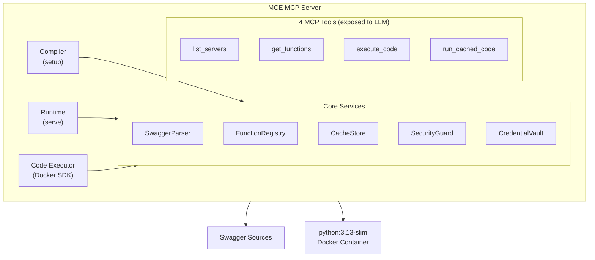
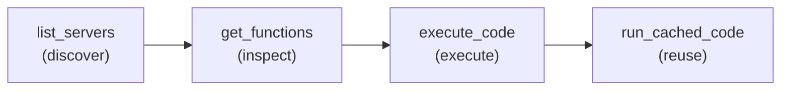

# MCE — MCP Code Execution

> **APIs were designed for developers. MCE recompiles them for AI.**

MCE is a production-grade [MCP (Model Context Protocol)](https://modelcontextprotocol.io/) server that converts **Swagger/OpenAPI specifications into LLM-native Python functions** and executes them inside isolated Docker containers. Instead of flooding LLM context with hundreds of endpoint-specific tools, MCE exposes exactly **4 meta-tools + 1 prompt** — letting the model discover, inspect, write, and reuse code against any number of APIs.

---

## Navigation

| Section | Description |
|---------|-------------|
| [Architecture Overview](#architecture-overview) | How MCE is structured end-to-end |
| [Getting Started](Getting-Started) | Installation, configuration, and first run |
| [MCP Tools Reference](MCP-Tools-Reference) | All 4 tools + 1 prompt, with examples |
| [Configuration Reference](Configuration-Reference) | Environment variables and swagger config |
| [Security Model](Security-Model) | Defense-in-depth layers and credential isolation |
| [Compiler Pipeline](Compiler-Pipeline) | How Swagger specs become Python functions |
| [SIMD Pattern](SIMD-Pattern) | Writing reusable, cacheable code |
| [Contributing](Contributing) | Setup, workflow, coding standards, PR checklist |

---

## Why MCE?

When integrating REST APIs with LLMs via MCP, the naive approach — one tool per endpoint — creates compounding problems:

| Problem | Impact |
|---------|--------|
| **Context window bloat** | A 200-endpoint API burns hundreds of tokens per call just describing tools |
| **Tool processing limits** | MCP clients cap tool counts; large APIs hit the limit and fail silently |
| **Insecure code execution** | Running LLM-generated code on the host is dangerous |
| **Bloated responses** | Raw API responses include metadata, nulls, and deprecated fields the model never needs |
| **Integration friction** | Developers spend days writing auth wrappers and prompt scaffolding for every new API |

MCE eliminates all five problems with a single pattern: **compile once, discover–inspect–execute–reuse**.

---

## Architecture Overview



### Subsystems at a Glance

| Subsystem | Responsibility |
|-----------|---------------|
| **Compiler** | Parses Swagger/OpenAPI specs, generates typed Python functions via Jinja2, writes manifests |
| **Runtime** | Loads compiled manifests at startup, serves function metadata to MCP tools |
| **Executor** | Validates code (size → AST guard → lint), runs it in a Docker sandbox, returns results |
| **Cache** | Async SQLite store keyed by code hash; enables the SIMD reuse pattern |
| **Security** | AST guard, credential vault, domain allowlist, read-only enforcement |

### LLM Workflow



---

## Quick Example

```python
# 1. Discover available APIs
list_servers()
# → { "servers": [{ "name": "weather", "functions": ["get_current_weather", ...] }] }

# 2. Inspect the function signature
get_functions([{"server_name": "weather", "function_name": "get_current_weather"}])
# → { "functions": [{ "parameters": [...], "import_statement": "from weather.functions import get_current_weather", ... }] }

# 3. Write and execute code
execute_code("""
from weather.functions import get_current_weather

city = "London"    # top-level variable — the only thing that changes per request

def main():
    return get_current_weather(city=city, units="metric")

result = main()
""", description="get weather by city")
# → { "success": true, "data": { "temperature": 15.2, "condition": "Cloudy" }, "cache_id": "abc123" }

# 4. Reuse for a different city — no rewriting code
run_cached_code("abc123", params={"city": "Paris"})
# → { "success": true, "data": { "temperature": 18.5, "condition": "Sunny" }, "cache_id": "def456" }
```

---

## Project Status

| Item | Status |
|------|--------|
| Version | 0.1.0 (Beta) |
| Python | 3.13+ |
| License | MIT |
| Test coverage gate | ≥ 90% |
| CI | GitHub Actions |

---

*Continue to [Getting Started](Getting-Started) →*
