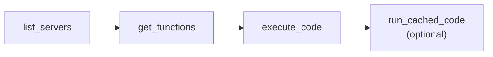
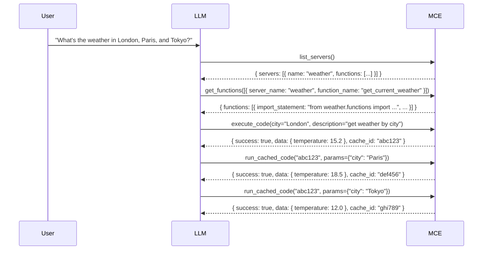

# MCP Tools Reference

MCE exposes exactly **4 tools + 1 prompt** to the LLM. This intentionally small surface area keeps token usage low and enforces a consistent interaction pattern.

---

## Tool Overview

| Tool | When to use |
|------|-------------|
| [`list_servers`](#1-list_servers) | First call in any session — discover what APIs are available |
| [`get_functions`](#2-get_functions) | Before writing any code — inspect signatures and return types |
| [`execute_code`](#3-execute_code) | Run Python code against one or more APIs |
| [`run_cached_code`](#4-run_cached_code) | Reuse a previous execution with different input values |

| Prompt | When to use |
|--------|-------------|
| [`reusable_code_guide`](#prompt-reusable_code_guide) | Remind the LLM of the top-level variable pattern |

---

## Required Call Order



**`get_functions` must be called before `execute_code`.** It returns the exact `import_statement`, parameter names, and response schema. Guessing produces broken code.

---

## 1. `list_servers`

Returns a compact index of all compiled API servers and their available functions.

**Input:** none

**Output:**

```json
{
  "sandbox_libraries": ["httpx", "pydantic", "orjson"],
  "servers": [
    {
      "name": "weather",
      "summary": "Weather data for US locations",
      "functions": [
        { "name": "get_current_weather", "summary": "Get current conditions for a location" },
        { "name": "get_forecast",        "summary": "Get 7-day forecast" }
      ]
    }
  ]
}
```

`sandbox_libraries` lists the packages available inside the Docker container. Do not import anything else.

---

## 2. `get_functions`

Batch-fetches full details for 1–5 functions. Returns typed signatures, parameter descriptions, response schemas, and a ready-to-use import statement.

**Input:**

```json
[
  { "server_name": "weather", "function_name": "get_current_weather" },
  { "server_name": "weather", "function_name": "get_forecast" }
]
```

**Output:**

```json
{
  "functions": [
    {
      "server_name": "weather",
      "function_name": "get_current_weather",
      "import_statement": "from weather.functions import get_current_weather",
      "parameters": [
        {
          "name": "city",
          "type": "str",
          "required": true,
          "description": "City name, e.g. 'London'"
        },
        {
          "name": "units",
          "type": "str",
          "required": false,
          "default": "metric",
          "description": "Temperature units: metric | imperial"
        }
      ],
      "return_type": "GetCurrentWeatherResponse",
      "usage_example": "class GetCurrentWeatherResponse(TypedDict, total=False):\n    temperature: float\n    condition: str\n    humidity: int\n\ndef get_current_weather(city: str, units: str = 'metric') -> GetCurrentWeatherResponse:\n    ..."
    }
  ]
}
```

### TypedDict Return Types

At compile time, MCE parses each endpoint's response schema and generates a `TypedDict` class. This lets the LLM chain calls with confidence — field names and types are explicit, not guessed:

```python
class GetCurrentWeatherResponse(TypedDict, total=False):
    temperature: float
    condition: str
    humidity: int
    wind_speed: float

def get_current_weather(city: str, units: str = "metric") -> GetCurrentWeatherResponse:
    ...
```

Functions without a parseable response schema fall back to `-> Any`.

---

## 3. `execute_code`

Runs Python code inside an isolated Docker sandbox and returns the result.

**Input:**

| Parameter | Type | Description |
|-----------|------|-------------|
| `code` | `str` | Python source code. Must follow the [code contract](#code-contract) below. |
| `description` | `str` | Short human-readable description. Used to index the cache for future lookup. |

**Output (success):**

```json
{
  "success": true,
  "data": { "temperature": 15.2, "condition": "Cloudy" },
  "cache_id": "abc123def456...",
  "execution_time_ms": 312
}
```

**Output (failure):**

```json
{
  "success": false,
  "error": "SecurityViolationError: import of 'os' is not allowed",
  "cache_id": null
}
```

### Code Contract

Every `execute_code` payload must follow these rules:

1. **Define a `main()` function** that takes no arguments.
2. **All dynamic values must be top-level variables** — `main()` reads them as globals.
3. **Call `result = main()`** at module level.
4. **Import only from compiled server modules** (listed in `list_servers`) and the sandbox libraries.
5. **No dangerous imports** — `os`, `sys`, `subprocess`, `socket`, and 70+ other modules are blocked by the AST guard.

```python
# CORRECT — top-level variable pattern
from weather.functions import get_current_weather

city = "London"     # top-level: will be injectable via run_cached_code

def main():
    return get_current_weather(city=city, units="metric")

result = main()
```

```python
# INCORRECT — hardcoded value inside main()
def main():
    return get_current_weather(city="London", units="metric")   # cannot be reused

result = main()
```

### Cache Behavior

Every successful `execute_code` stores the code and description in the SQLite cache. The returned `cache_id` is a SHA-256 hash of the normalized code. Identical code always produces the same `cache_id` — subsequent calls are served from cache.

---

## 4. `run_cached_code`

Re-executes a previously cached code snippet with different top-level variable values. This is the **SIMD pattern** — same code, different data.

**Input:**

| Parameter | Type | Description |
|-----------|------|-------------|
| `cache_id` | `str` | The `cache_id` returned by a previous `execute_code` call. |
| `params` | `dict \| null` | Key-value pairs to inject as top-level variable assignments before execution. |

**Output:** Same structure as `execute_code`.

**Example:**

```
# First call
execute_code(...city = "London"...) → cache_id: "abc123"

# Reuse for Paris
run_cached_code("abc123", params={"city": "Paris"})
→ { "success": true, "data": { "temperature": 18.5, ... }, "cache_id": "def456" }

# Reuse for Tokyo
run_cached_code("abc123", params={"city": "Tokyo"})
→ { "success": true, "data": { "temperature": 12.0, ... }, "cache_id": "ghi789" }
```

`params` injects assignments **before** the cached code runs:

```python
# What actually executes:
city = "Paris"     # injected from params
# ...rest of cached code...
from weather.functions import get_current_weather
def main():
    return get_current_weather(city=city, units="metric")
result = main()
```

> `params` keys must match the top-level variable names in the original code exactly.

---

## Prompt: `reusable_code_guide`

A built-in prompt that returns concise rules for writing parameterized, cacheable code. Call it at the beginning of a complex session or when the LLM seems to be hardcoding values.

**Input:** none

**Output:** A plain-text guide reminding the model to:
- Use top-level variables for all dynamic values
- Always call `get_functions` before writing code
- Structure code so `run_cached_code` can replay it with new inputs

---

## Full Workflow Example



Three API calls. Only one piece of code. No token waste on repeated tool descriptions.

---

*Next: [Configuration Reference](Configuration-Reference) →*
